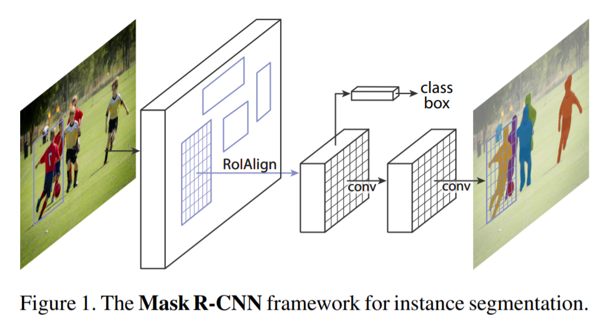

[paper](https://arxiv.org/pdf/1703.06870.pdf)

[code](https://github.com/facebookresearch/Detectron)

## 摘要

Mask R-CNN 是一种简单、灵活且通用的框架，其在Faster R-CNN 上进行改进，通过在检测框回归分支外额外增加掩膜预测分支，实现同时对目标包围框与目标掩膜的预测。

算法优势:

* 容易训练(同时使用掩膜分支损失与包围框分支损失，可取得更佳的训练效果)，且相较Faster R-CNN只增加了一个分支，计算量增长不大,fps 5.(速度与Faster R-CNN相当)

* 泛化性强，可应用于其他类似领域，如目标跟踪(Siamese->SiamRPN->SiamMask)

* 性能优越，在多个任务上超越已有算法(2016以前)

## 引言

研究领域：实例分割=目标检测+语义分割

Mask R-CNN结构：Faster R-CNN+Mask 分支;重难点：特征对齐（RoIAlign)

## 相关工作

R-CNN:R-CNN->fast RCNN->faster RCNN

实例分割:先前工作，先分割后分类；本文则同时进行

## 实现

关键特色:

* RoIAlign:使用双线性插值来消除RoIPool中由于量化引入的偏差

* Mask 分支与FPN 图像特征金字塔的使用

* 训练时三分支一起训练(class,box,mask),推理时先(class,box)经NMS再mask

## 实验

* 实例分割

   1. RoIAlign优于RoIPool与RoIWarp,主要是由于RoIAlign采用的双线性插值消除了量化引入的定位误差，对实例分割这种像素级精度有很好效果。

   2. Mask预测根据不同类别分别预测，解耦分类与分割，不使用类间竞争的方式(这种方式加大了任务的难度，效果不佳);Mask也可以采取类别无关的预测方式，精度略微下降

   3. 图像特征金字塔FCN可以起到正向作用

* 人体姿态估计

   1. 对Mask进行改变，使其可用于关键点预测

   2. box、mask分支可以提升关键点预测分支效果，但关键点预测分支会略微降低box、mask分支精度，但三者可以同时达到较佳效果

   3. 关键点定位为像素级精度，RoIAlign有明显提升作用。

* Cityscapes数据集测试

   1. 数据集类别分布不均衡，所以使用COCO数据集上预训练的模型可以提升整体效果

* 训练tricks
  
   1. Updated baseline,调整网络超参数

   2. 端到端训练

   3. 使用ImageNet-5k预训练

   4. Train-time augmentation，尺度随机缩放

   5. Model architecture，ResNeXt-101->ResNeXt-152

   6. Using the recently proposed non-local (NL) model

   7. Test-time augmentation，综合多个尺度下测试结果

## 总结

1. 采用多任务学习的方式，增加Mask分支，一方面降低了模型训练难度，提升了模型最终精度，同时扩展了算法应用范围（实例分割）。

2. RoIAlign对于定位精度要求高的算法作用较大。

## 读后感

1. Mask分支启发，多发散思考，目标检测可以输出不同比例的矩形框，为什么不能输出更加精确的mask掩膜？

2. 多任务学习可以有效降低模型训练难度。

3. RoIAlign的出现很可能是由于RoIPool以及RoIWarp在实例分割中表现差强人意，经分析后推断原因可能是特征未对齐的原因，而后才有了RoIAlign的尝试。所以当以后有idea但结果不如人意时,要多分析其深层次的原因，失败与成功只差一步。

## 代码学习

